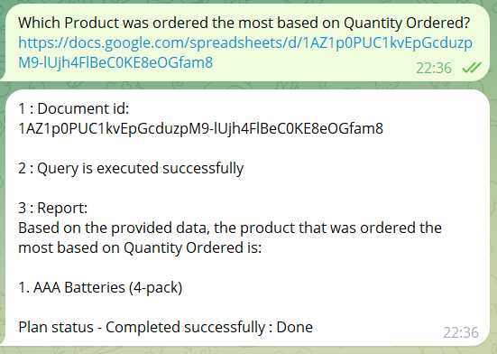
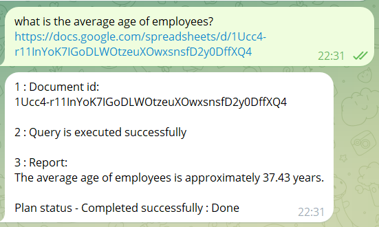
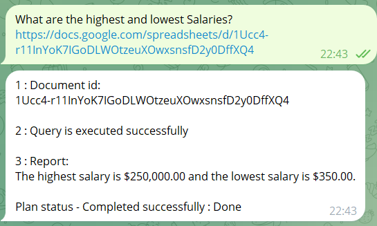
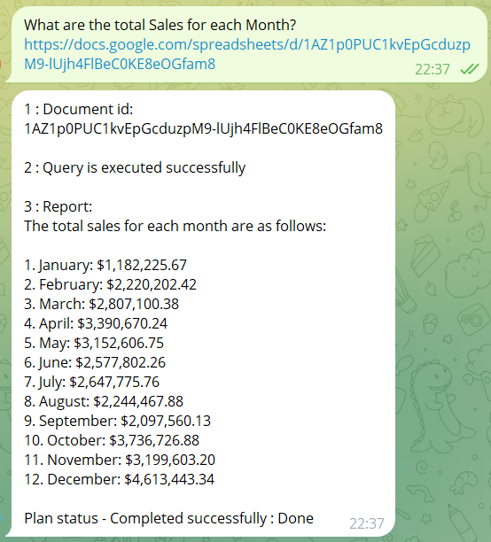

# Telegram bot alias
[@JustNewInnoBot](https://t.me/JustNewInnoBot)

# Project description

Our idea is to provide service for automatic querying Google Sheets for business insights extraction.

1) User sends query in natural language with link to Google Sheet from which he want to receive business insight
2) Our service downloads spreadsheet in csv format
3) LLM generates query in SQL language based on user message and table schema
4) Service executes query on table and provide results
5) LLM generates concise and accurate report based on the query result and user message and print it to the user

# Datasets used:
1) [https://docs.google.com/spreadsheets/d/1Ucc4-r11InYoK7IGoDLWOtzeuXOwxsnsfD2y0DffXQ4](https://docs.google.com/spreadsheets/d/1Ucc4-r11InYoK7IGoDLWOtzeuXOwxsnsfD2y0DffXQ4)
2) [https://docs.google.com/spreadsheets/d/1AZ1p0PUC1kvEpGcduzpM9-lUjh4FlBeC0KE8eOGfam8](https://docs.google.com/spreadsheets/d/1AZ1p0PUC1kvEpGcduzpM9-lUjh4FlBeC0KE8eOGfam8)

# Plan execution examples

# Business applications:

1. Business and Management
    - Sales analysis and reporting.
    - KPI and performance tracking.
2. Finance and accounting
    - Automation of calculation of taxes and fees.
    - Income and expense reports.
    - Financial planning and budget analysis.
3. Education
    - Analysis of student performance.
    - Managing schedules and attendance.
    - Evaluation of the effectiveness of educational programs.
4. Production
    - Analysis of the productivity and efficiency of processes.
    - Inventory management of raw materials and finished products.

